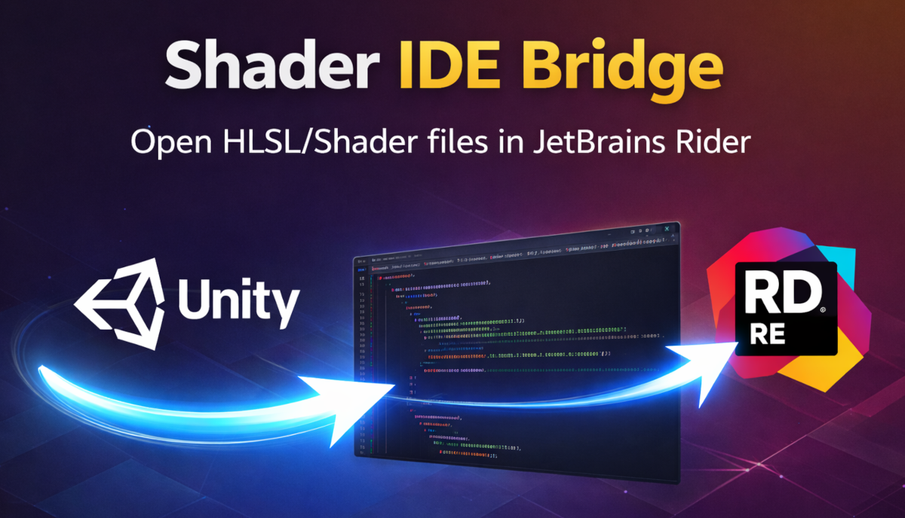

# Unity Shader IDE Bridge for Rider



<p align="center">
  <a href="../README.md">English</a> · <a href="README.ko.md">한국어</a> · <a href="README.ja.md">日本語</a> · <a href="README.zh.md">中文</a>
</p>

シェーダー関連ファイルは **JetBrains Rider** で開き、**C# スクリプト**は **メイン IDE**（Visual Studio / VS Code / etc.）で開き続けます。

> Unity は **External Script Editor** を 1 つしか選べません。このパッケージは次の分離ワークフローを提供します:
> - C# → メイン IDE  
> - Shader/HLSL/etc. → Rider

**UPM パッケージ名:** `com.clerin.unity.shader-ide-bridge-rider`

---

## Installation (UPM / Git URL)

Unity: `Window > Package Manager > + > Add package from git URL...`

```text
https://github.com/jinhyeonseo01/UnityShaderIDEBridge-Rider.git
```

特定のバージョンタグ:

```text
https://github.com/jinhyeonseo01/UnityShaderIDEBridge-Rider.git#v1.0.0
```

---

## Quick Setup

1. Unity: `Edit > Preferences > External Tools`
2. **External Script Editor** を **C# IDE**（Visual Studio / VS Code / etc.）に設定
3. Project Settings を開く: `Project > Clerin > Shader IDE Bridge`

### Settings

| 設定 | 意味 |
|---|---|
| **Enable OnOpenAsset Bridge** | シェーダーファイルをフックして Rider で開く |
| **Enable Diagnostics Warnings** | Rider を解決できない場合に警告をログ出力 |

**注意:** External Script Editor がすでに **Rider** の場合、ブリッジは **非アクティブ**（Unity 既定動作）になり、手動メニューも非表示/無効になります。

---

## Features

- シェーダー関連拡張子に対してのみ Unity の `OnOpenAsset` をフック
- Unity の *External Script Editor* 設定を **変更しない**
- **Toolbox / Program Files / PATH / 環境変数**で Rider を検出し、行指定（`--line`）付きで起動
- Rider が (未)検出となった *理由* を確認できる **Diagnostics** を同梱

---

## Supported File Types

`.shader`, `.compute`, `.hlsl`, `.cginc`, `.glslinc`, `.cg`

---

## Requirements

- Unity **6000.3.x**（Unity 6.3 ベースライン）
- JetBrains **Rider** をインストール済み
- Unity パッケージ **`com.unity.ide.rider`**（`package.json` に宣言済み）

### Recommended（信頼性 + 速度）

次の環境変数のいずれかに Rider の実行ファイルを設定してください:

- `RIDER_PATH` *(推奨)*
- `JETBRAINS_RIDER_PATH`
- `JETBRAINS_RIDER`

Windows 例:

```text
C:\Program Files\JetBrains\JetBrains Rider 2025.x\bin\rider64.exe
```

---

## Usage

### Automatic (recommended)

- Unity Project ウィンドウで対応シェーダーファイルをダブルクリックします。

### Manual

- 対応アセットを選択
- `Tools > Clerin > Shader IDE Bridge > Open In Rider`

### Diagnostics

- `Tools > Clerin > Shader IDE Bridge > Validate Rider Shader Setup`
- `Tools > Clerin > Shader IDE Bridge > Clear Rider Cache` *(次回オープン時にパスを再スキャン)*

---

## Limitations (by design)

- カスタム include のインデックス化/ミラーリングなし
- 追加の言語サービス/パース層なし  
  → Shader/HLSL の解析・ナビゲーション・include 解決は Rider が担当します。

---

## Troubleshooting

### Rider が開かない / 初回が遅い

- 実行: `Tools > Clerin > Shader IDE Bridge > Validate Rider Shader Setup`
- 初回のパス探索を減らすために `RIDER_PATH` を設定してください。

### ファイルがフックされない

- リストにある拡張子のみ処理されます。
- External Script Editor が Rider の場合は設計上フックが無効になります。

### 別の IDE で開かれる

- External Script Editor が **Rider ではないこと**を確認してください（本パッケージは分離 IDE ワークフロー向けです）。

---

## License

MIT — `LICENSE.md` を参照
