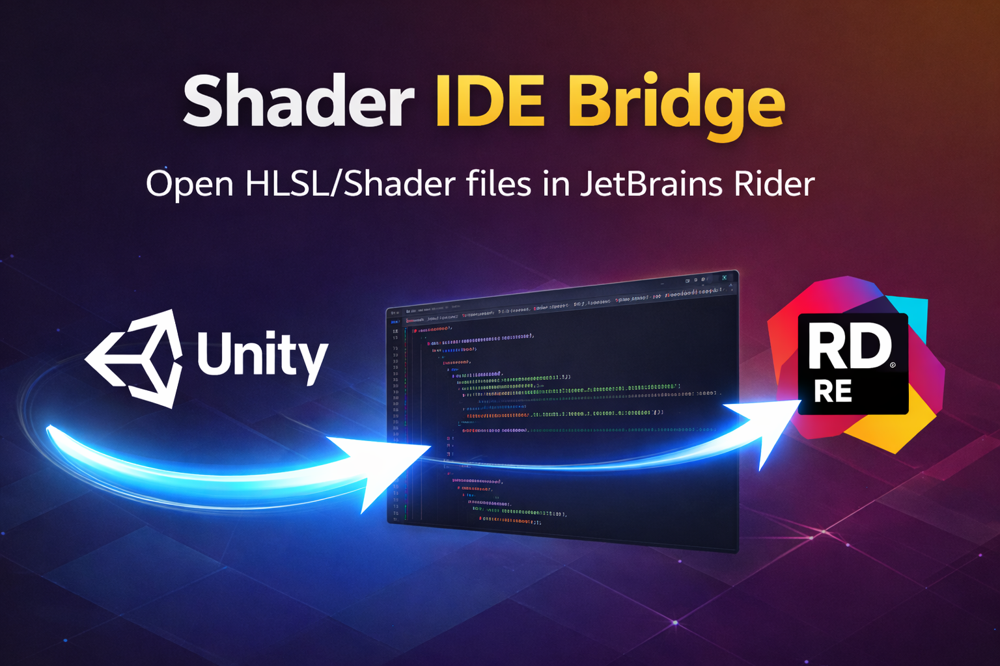

# Unity Shader IDE Bridge (Rider)



<p align="center">
  <a href="README.md">English</a> · <a href="docs/README.ko.md">한국어</a> · <a href="docs/README.ja.md">日本語</a> · <a href="docs/README.zh.md">中文</a>
</p>

`com.clerin.unity.shader-ide-bridge-rider` is a Unity Editor package that opens shader-related files in JetBrains Rider,
while keeping C# scripts opening in your main IDE (for example Visual Studio 2026).

This is for the workflow where Unity can only pick one External Script Editor, but you want:

- C# in your primary IDE
- `.shader` / `.hlsl` / etc. in Rider

If your Unity External Script Editor is already Rider, this package stays inactive and does not intercept file opens.

## What It Does

- Intercepts double-click (Unity `OnOpenAsset`) for shader-related assets only.
- Does not change Unity's External Script Editor setting (your C# workflow stays as-is).
- Resolves Rider executable (Toolbox / Program Files / `PATH` / env vars) and launches Rider with `--line`.
- Provides a diagnostics report so you can see why Rider was (not) detected.

## Supported File Types

- `.shader`
- `.compute`
- `.cginc`
- `.glslinc`
- `.hlsl`
- `.cg`

## Requirements

- Unity `6000.3.x` (Unity 6.3 baseline)
- JetBrains Rider installed
- Unity package `com.unity.ide.rider` (declared in `package.json`)

Recommended for reliability and speed:

- Set `RIDER_PATH` (or `JETBRAINS_RIDER_PATH` / `JETBRAINS_RIDER`) to your Rider executable path.
  - Windows example: `C:\Program Files\JetBrains\JetBrains Rider 2025.x\bin\rider64.exe`

## Installation (UPM)

Unity: `Window > Package Manager > + > Add package from git URL...`

```text
https://github.com/jinhyeonseo01/UnityShaderIDEBridge-Rider.git
```

Specific tag:

```text
https://github.com/jinhyeonseo01/UnityShaderIDEBridge-Rider.git#v0.1.0
```

## Setup

1. Unity: `Edit > Preferences > External Tools`
2. Set `External Script Editor` to your C# IDE (Visual Studio, VS Code, etc.)
3. Project Settings: `Project/Clerin/Shader IDE Bridge`

Settings:

- `Enable OnOpenAsset Bridge`: enables the shader-only bridge.
- `Enable Diagnostics Warnings`: logs warnings when Rider cannot be resolved.

Note:

- If `External Script Editor` is Rider, the bridge is disabled (Unity default open flow is used) and the manual menu is hidden/disabled.

## Usage

Automatic:

- Double-click a supported shader file in the Unity Project window.

Manual:

- Select a supported asset
- `Tools/Clerin/Shader IDE Bridge/Open In Rider`

Diagnostics:

- `Tools/Clerin/Shader IDE Bridge/Validate Rider Shader Setup`
- `Tools/Clerin/Shader IDE Bridge/Clear Rider Cache` (forces a fresh path scan on next open)

## Limitations (By Design)

- No custom include indexing, no include-mirroring, no language service.
- Rider is responsible for Shader/HLSL parsing, navigation, and include resolution.

## Troubleshooting

- Rider does not open or opens slowly the first time:
  - Run diagnostics: `Tools/Clerin/Shader IDE Bridge/Validate Rider Shader Setup`.
  - Set `RIDER_PATH` to the Rider executable to avoid path probing on first open.
- File is not intercepted:
  - Only the listed extensions are handled.
  - If Unity External Script Editor is Rider, interception is disabled by design.
- It opens in the wrong IDE:
  - Check that `External Script Editor` is not Rider (this package is meant for split-IDE setups).

## License

MIT (see `LICENSE.md`)
